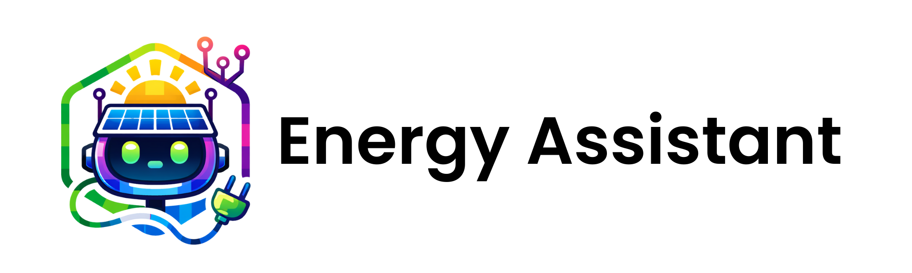
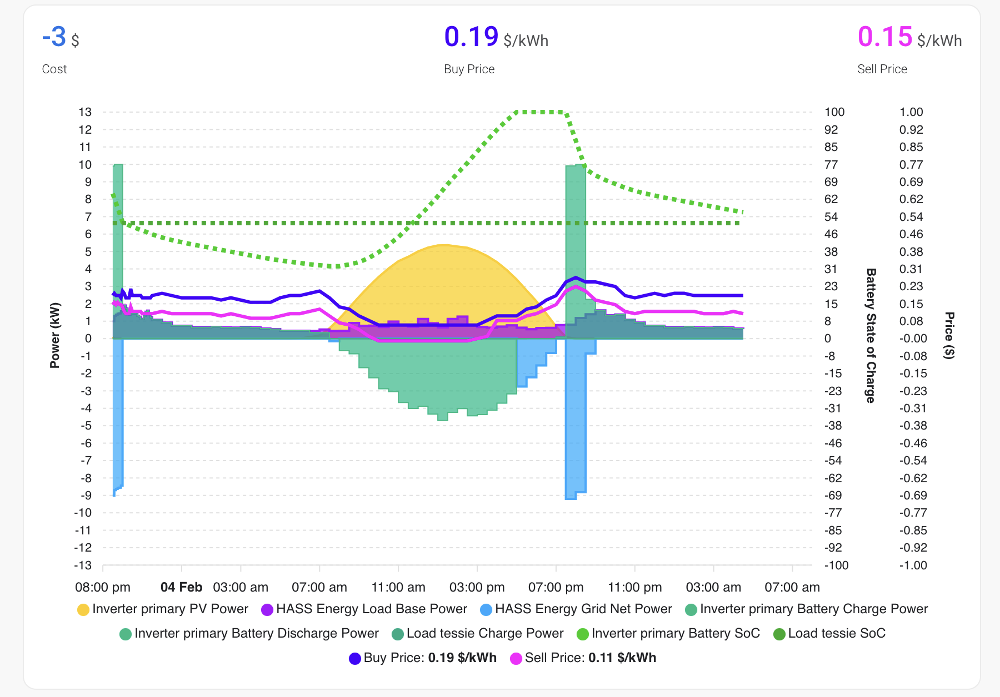

## Energy Assistant

Energy Assistant is a home energy management engine. It ingests live + forecast data from pluggable data
connectors, builds a plan, and exposes a small API so you can automate how your home imports, exports,
and stores energy.

### What it does
- Pulls live and forecast data from a data connector.
- Builds a plan for grid import/export, storage, and flexible loads.
- Runs a lightweight API for plan runs and settings.

### Supported data connectors
- Home Assistant (current connector). An early POC custom integration is included to surface plans as
  entities so you can automate from the HA UI.
- More connectors and direct forecasting integrations are planned. The core is connector-agnostic so
  new platforms can be added without changing the planning logic.

### Similar projects
- [EMHASS](https://github.com/davidusb-geek/emhass) – Home Assistant-focused energy management and optimization.
- [HAEO](https://github.com/hass-energy/haeo/) - Home Assistant Energy Optimizer

### Status
This is early, unreleased software. The planner is wired but still evolving, so outputs should be treated as experimental.

### Quickstart
See `QUICKSTART.md` for setup steps, a full config example, and Docker instructions.

### Documentation
Getting started: `QUICKSTART.md`. Architecture and developer workflows: `README_DEV.md`.

### Project tracking
We track work items in GitHub Issues (instead of a checked-in TODO list).
