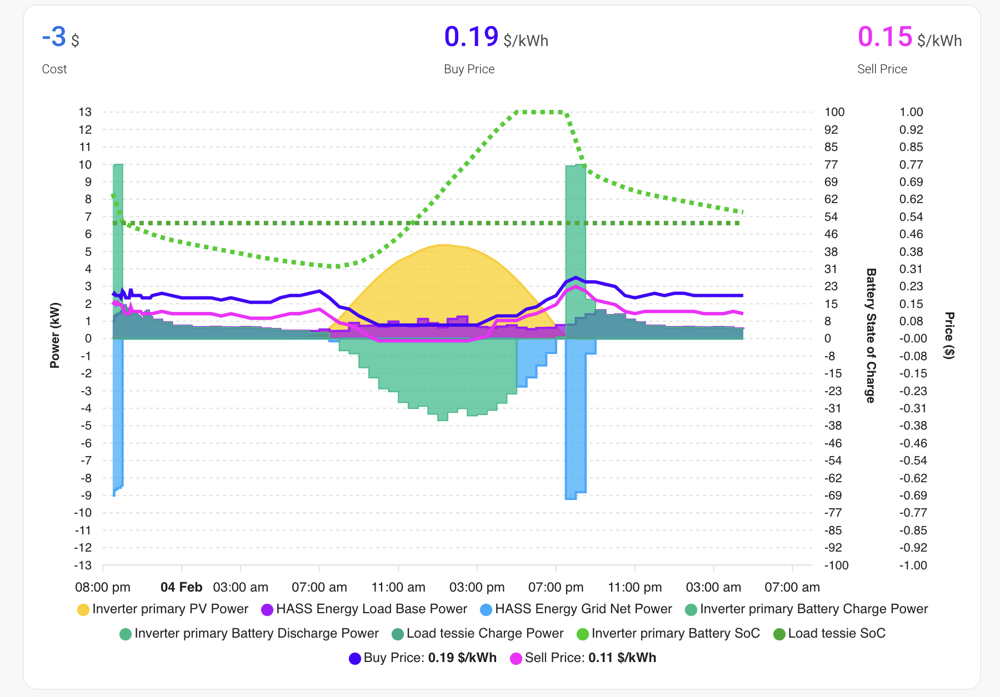

## Energy Assistant

Energy Assistant is a source-agnostic home energy management engine. It ingests live and forecast
data, builds an EMS plan, and exposes a small API for automation.

### What it does
- Pulls live and forecast data from configured sources. Home Assistant is the current source backend.
- Builds a plan for grid import/export, storage, and flexible loads.
- Runs a lightweight API for triggering and reading plan runs.
- Includes an optional Home Assistant custom integration that surfaces plan data as entities.

### Similar projects
- [EMHASS](https://github.com/davidusb-geek/emhass) - Home Assistant-focused energy management and optimization.
- [HAEO](https://github.com/hass-energy/haeo/) - Home Assistant Energy Optimizer

### Status
This is early, unreleased software. The planner is wired but still evolving, so outputs should be treated as experimental.

### Quickstart
See `QUICKSTART.md` for setup steps, a representative config example, and Docker instructions.

### Documentation
Getting started: `QUICKSTART.md`. Developer reference: `CONTRIBUTING.md`.

### Project tracking
We track work items in GitHub Issues (instead of a checked-in TODO list).
